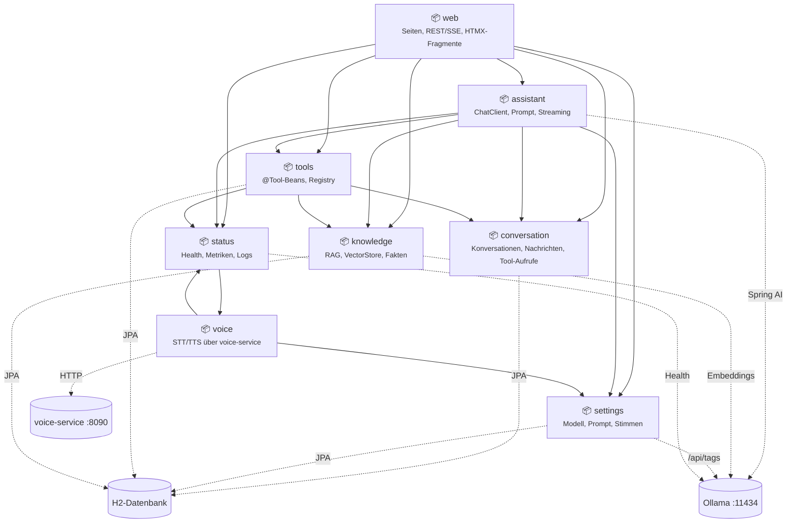
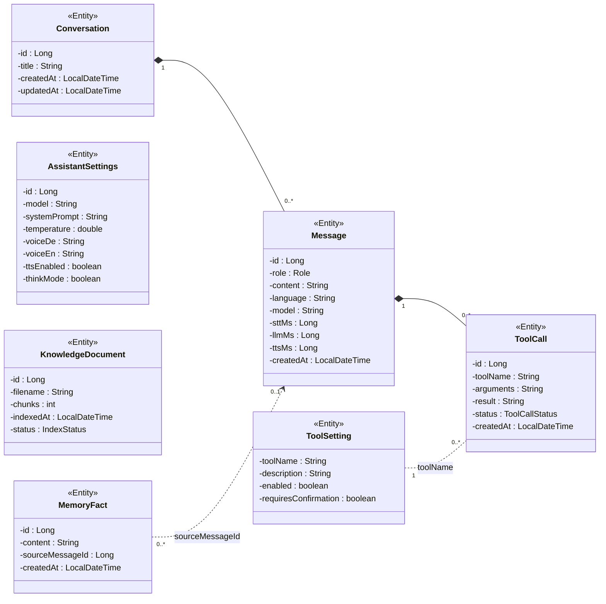
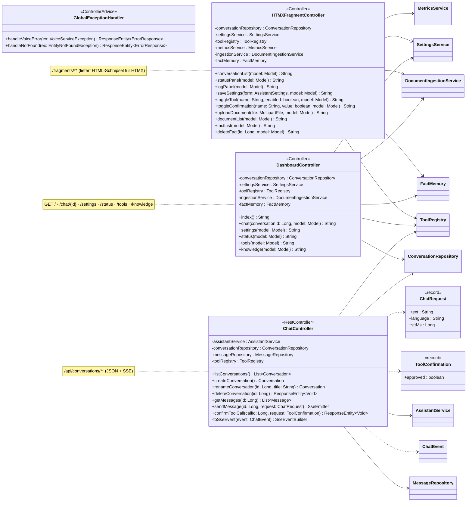
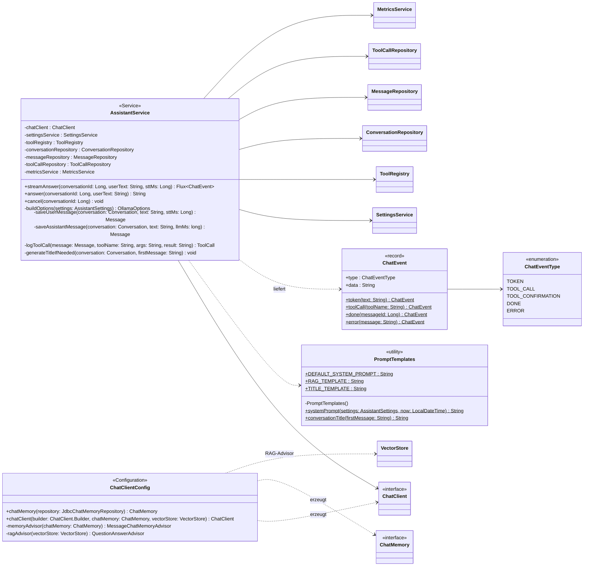
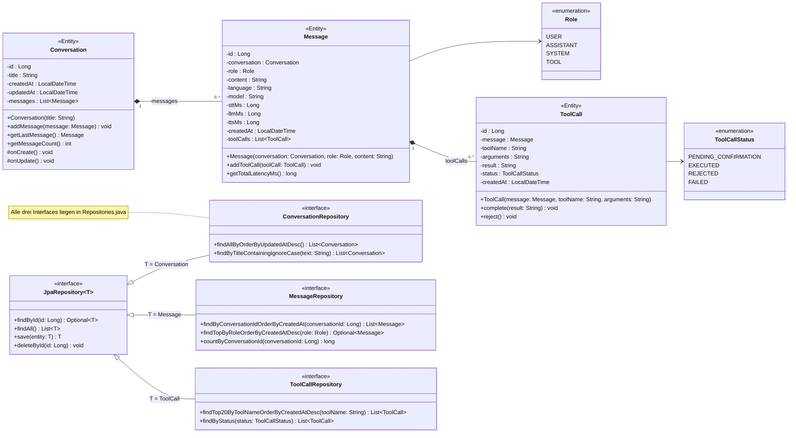
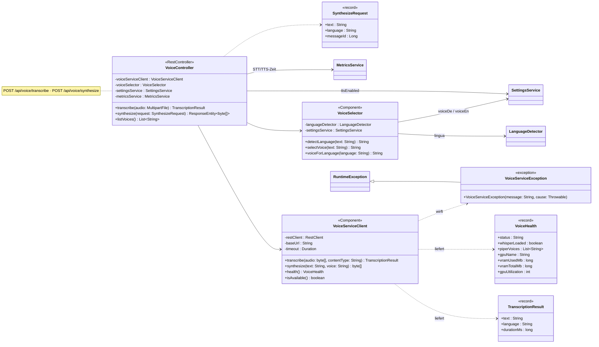
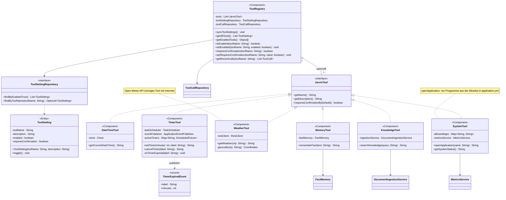
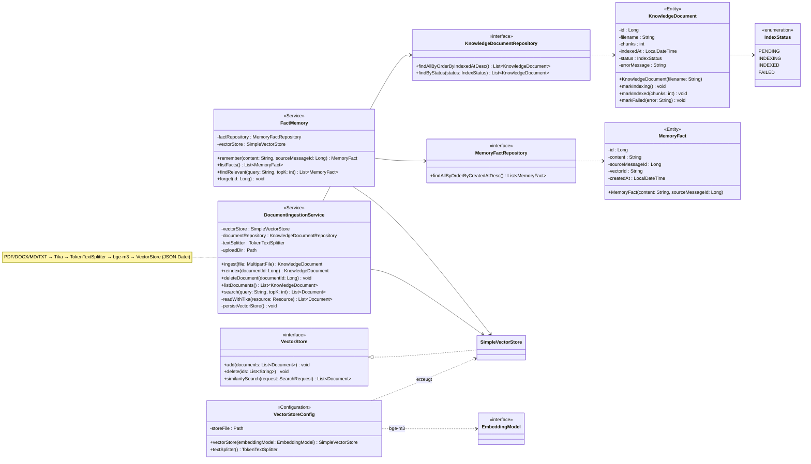
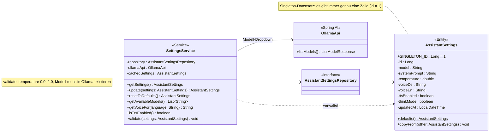
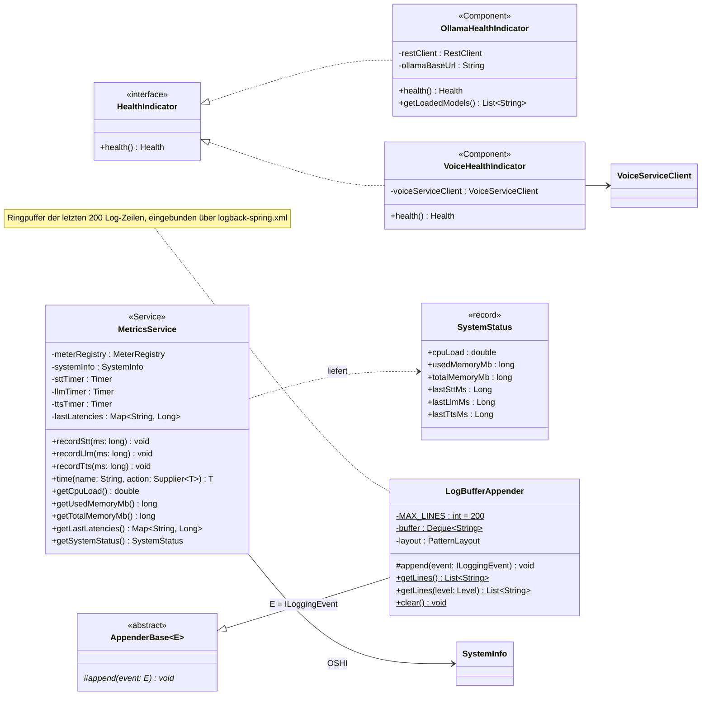

# Jarvis – UML-Diagramme (Entwurf)

Entwurf der Klassen im Paket `de.grauk.jarvis` mit möglichen Attributen und Methoden.
Grundlage ist die Architektur aus der [README](../README.md). Die Klassen im Code sind noch leer;
Klassen mit dem Vermerk *(neu)* existieren noch nicht als Datei und werden vorgeschlagen.

**Legende:** `+` public, `-` private, `#` protected, `$` static, `*` abstract ·
`<<Entity>>` = JPA-Entity (H2-Tabelle) · `<<record>>` = Java-Record (DTO) ·
Klassen ohne Inhalt in einem Package-Diagramm stammen aus einem **anderen Package** bzw. aus Spring/Bibliotheken.

**Inhalt**

1. [Package-Übersicht](#1-package-übersicht)
2. [Datenmodell](#2-datenmodell-alle-entities)
3. [web](#3-package-web)
4. [assistant](#4-package-assistant)
5. [conversation](#5-package-conversation)
6. [voice](#6-package-voice)
7. [tools](#7-package-tools)
8. [knowledge](#8-package-knowledge)
9. [settings](#9-package-settings)
10. [status](#10-package-status)

---

## 1. Package-Übersicht

Nur die Abhängigkeiten zwischen den Packages (Pfeil = „verwendet“) und zu den externen Systemen.

| Package | verwendet | Grund |
|---|---|---|
| `web` | assistant, conversation, settings, tools, knowledge, status | Controller für alle Dashboard-Seiten |
| `assistant` | conversation, settings, tools, knowledge, status | Verlauf speichern, Settings lesen, aktive Tools, RAG, Latenz messen |
| `voice` | settings, status | Stimmenwahl, STT/TTS-Latenzen |
| `tools` | knowledge, status, conversation | `rememberFact`/`searchKnowledge`, `getSystemStatus`, letzte Aufrufe |
| `status` | voice | `VoiceHealthIndicator` fragt den voice-service ab |
| `knowledge`, `settings`, `conversation` | – | Basis-Packages ohne interne Abhängigkeiten |

---

## 2. Datenmodell (alle Entities)

Package-übergreifende Sicht auf die Tabellen in H2.

---

## 3. Package `web`

Liefert die Thymeleaf-Seiten, die REST/SSE-Endpoints für den Chat und die HTMX-Fragmente.

*(neu)*: `ChatRequest`, `ToolConfirmation`, `GlobalExceptionHandler`

---

## 4. Package `assistant`

Herzstück: baut den Prompt (System-Prompt + Verlauf + RAG + Tools) und streamt die Antwort von Ollama.

*(neu)*: `ChatEvent`, `ChatEventType` (die Events werden als SSE an den Browser geschickt)

---

## 5. Package `conversation`

Persistenz von Konversationen, Nachrichten und Tool-Aufrufen.

*(neu)*: `Role`, `ToolCall`, `ToolCallStatus`

---

## 6. Package `voice`

Brücke zum Python-Sidecar `voice-service` (faster-whisper + Piper).

*(neu)*: `TranscriptionResult`, `SynthesizeRequest`, `VoiceHealth`, `VoiceServiceException`

---

## 7. Package `tools`

Die Tools, die das LLM aufrufen darf, und ihre Verwaltung (an/aus, Bestätigungspflicht).

*(neu)*: `JarvisTool`, `DateTimeTool`, `TimerTool`, `TimerExpiredEvent`, `WeatherTool`, `MemoryTool`,
`KnowledgeTool`, `SystemTool`. Die Tool-Methoden tragen die Annotation `@Tool`.

---

## 8. Package `knowledge`

Dokument-Upload für RAG und das Langzeitgedächtnis (Fakten).

*(neu)*: `VectorStoreConfig`, `IndexStatus`, `MemoryFact`, beide Repositories

---

## 9. Package `settings`

Persistente Einstellungen des Assistenten, die im Dashboard geändert werden können.

*(neu)*: `AssistantSettingsRepository`

---

## 10. Package `status`

Systemzustand für die Status-Seite: Health-Ampeln, Latenzen, CPU/RAM und Log-Puffer.

*(neu)*: `SystemStatus`
